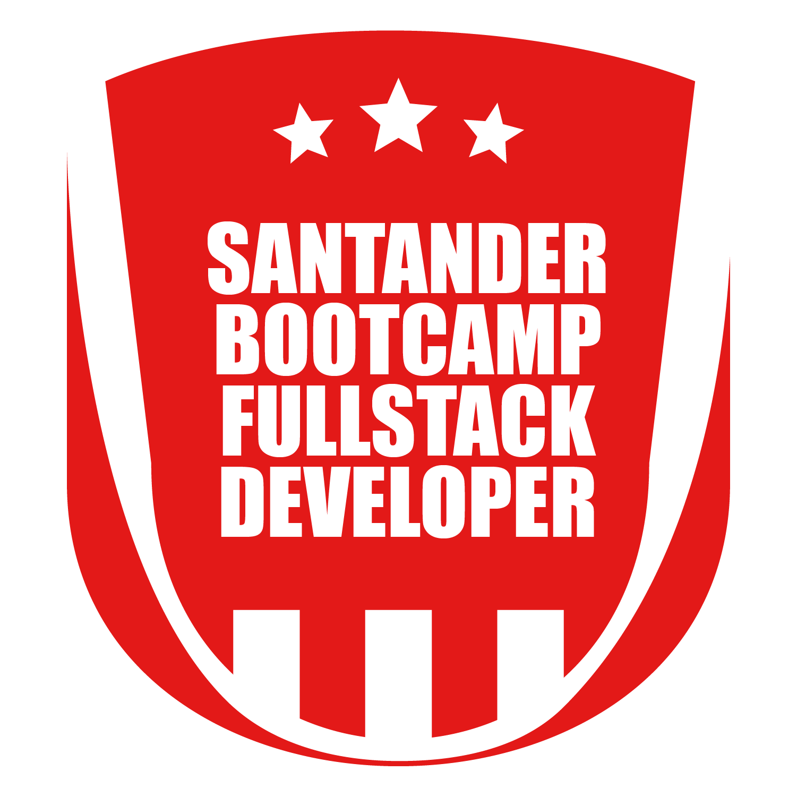

<h1 align="center">Meeting Room Manager - Java & Angular</h1>

<p align="center">



</p>

## About

Meeting Room Manager is an application to control meeting rooms. This includes: API / Web App.

This Project was developed for Santander Bootcamp Fullstack Developer in Digital Innovation One.

## Technologies

- Backend API (Java 11 with String Boot)
- Frontend (Angular)

## Run Project

### Clone Project

```git
git clone https://github.com/thiagotrs/meeting-room.git
```

### API

```shell
cd java-backend
mvn spring-boot:run
```

### WEB

```shell
cd angular-frontend
ng serve
```

### URLs

```
http://localhost:8082/api/v1/rooms
http://localhost:4200/
```

## Author

Thiago Rotondo Sampaio - [GitHub](https://github.com/thiagotrs) / [Linkedin](https://www.linkedin.com/in/thiago-rotondo-sampaio) / [Email](mailto:thiagorot@gmail.com)

## License

This project use MIT license, see the file [LICENSE](./LICENSE.md) for more details

---

<p align="center">Develop by <a href="https://github.com/thiagotrs">Thiago Rotondo Sampaio</a></p>